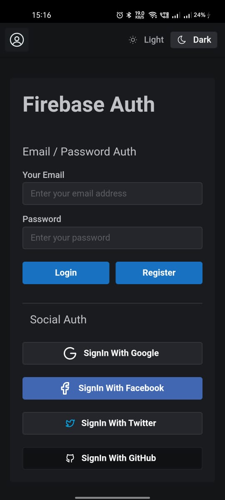
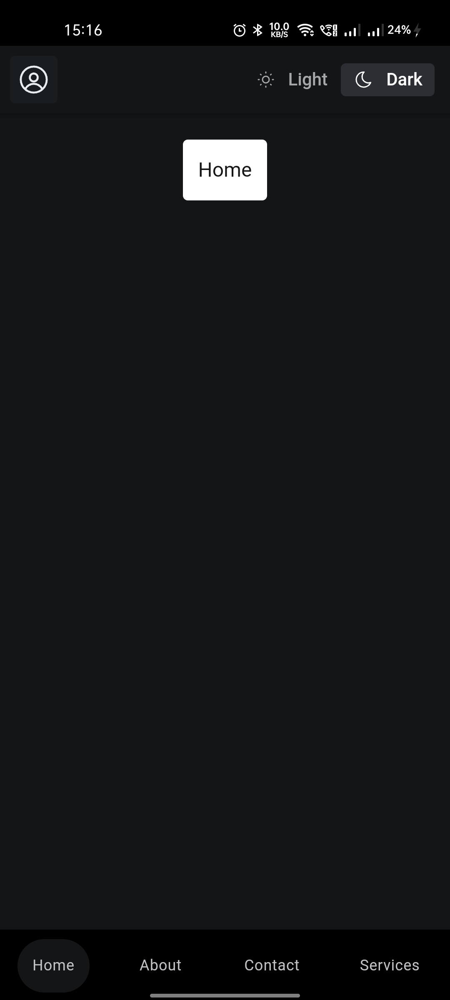
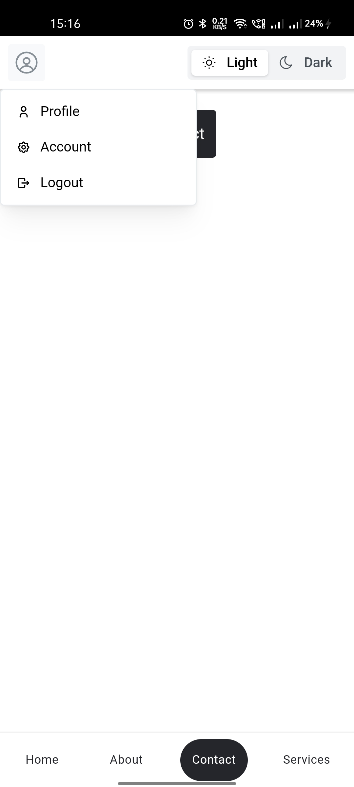

## Environment Variables

- duplicate the .env.example file and rename it to .env.local
- add the environment variable values

---
## Get SHA 1 Hash 

- run command `keytool -list -v -alias androiddebugkey -keystore ~/.android/debug.keystore`
- password: `android`

---
## App screenshots

  
  
  

